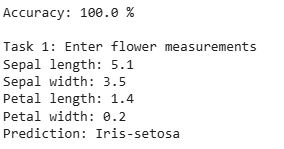
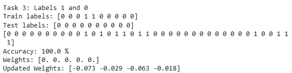

# Tutorial 1 – Understanding a Perceptron

## Objective
Build a perceptron from scratch to understand how the weighted sum, step activation function, and weight/bias update rule work, then train and test a perceptron on the Iris dataset to classify flowers as *Iris-setosa* or not.

## Files
`Tutorial_1.py` contains everything: the Perceptron class built from scratch, data loading, training, testing, accuracy, and the tasks.

## Tasks
**Task 1 – Manual input prediction:** The user enters sepal length, sepal width, petal length, and petal width. The trained model predicts and displays whether the flower is Iris-setosa or not.

**Task 3 – Labels 1 & 0:** The labels were changed from 1 / -1 to 1 / 0. The scikit-learn perceptron was retrained with the new labels, and a `PerceptronBinary` class was added whose step function outputs 1 or 0 so the from-scratch model also works with these labels.

## How to Run
Run `python Tutorial_1.py` (internet is needed to download the Iris dataset). Enter the four flower measurements when asked.

## Requirements
Python 3, NumPy, pandas, scikit-learn

## Output

### Training, Testing and Task 1

### Task 3
