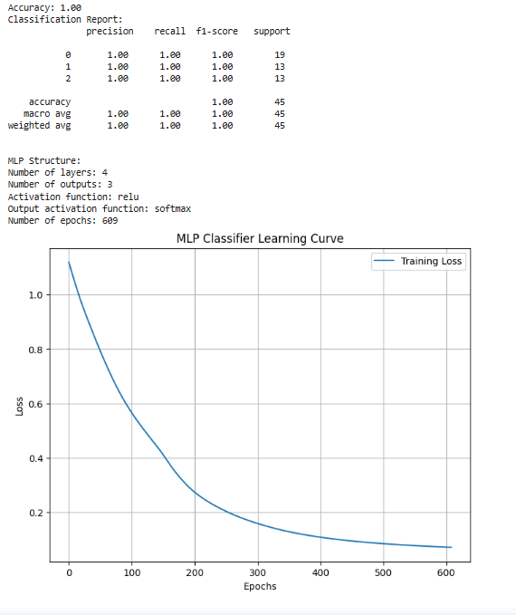
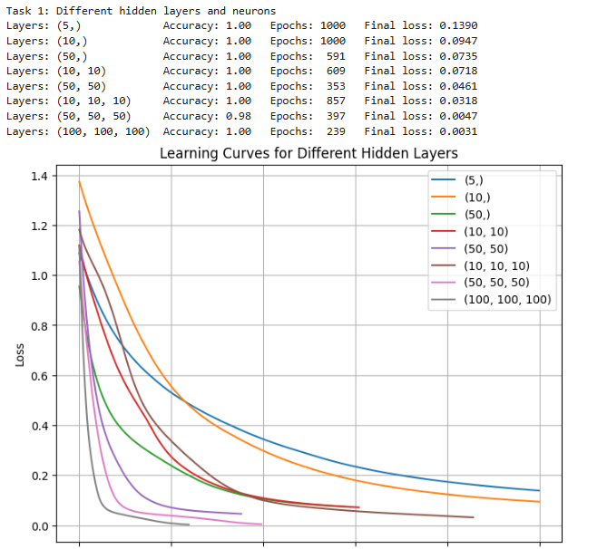
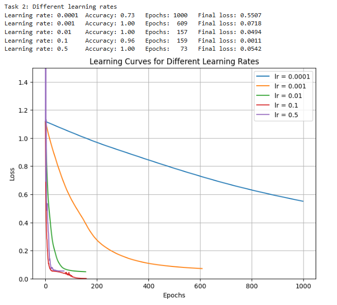

	# Tutorial 3 – Neural Network for MNIST Handwritten Digit Classification

## Objective
Build, train and evaluate a fully connected neural network in TensorFlow/Keras that classifies handwritten digits (0–9) from the MNIST dataset. The tutorial covers normalizing the images, one-hot encoding the labels, reading the model summary, plotting training and validation curves, and recognizing and fixing overfitting and underfitting.

## Files
`Tutorial_3.py` contains the full tutorial code and all three tasks.

## Tasks
**Task 1 – Different architectures:** The original (128, 64) ReLU network was compared with a wider network (512, 256), a deeper network (256, 128, 64, 32), a smaller network (32), and the original network using tanh and sigmoid activations.

**Task 2 – Different optimizers:** The original network was trained with SGD, RMSprop and Adam, and their training time, convergence and final accuracy were compared.

**Task 3 – Overfitting and underfitting:** The training and validation curves were used to judge whether the model was overfitting, underfitting or well-fitted. The model was trained for 2 and 30 epochs to see the effect of the number of epochs. Early stopping, L2 regularization and dropout were then applied, and an improved model was built using dropout with early stopping.

## How to Run
In Google Colab, upload the file and run `%run Tutorial_3.py`. TensorFlow is already installed in Colab. Selecting a GPU runtime (Runtime → Change runtime type → T4 GPU) makes training much faster.

## Requirements
Python 3, TensorFlow, NumPy, Matplotlib

## Output

### MLP Classifier

### Task 1

### Task 2
